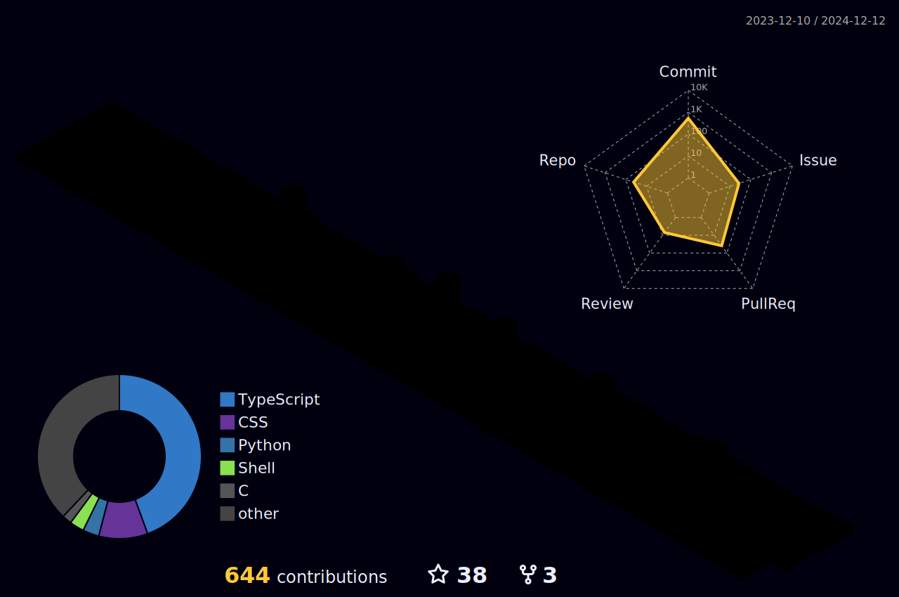

 
<h3 align="center">A Passionate cybersecurity student, driven by curiosity, seeks to master in machine learning-infused defense strategies.</h3>

<p align="left">  </p>


<p align="left"> <a href="https://twitter.com/abhishekpanthee" target="blank"></a> </p>

</br>


- 👨‍💻 All of my Cetificates are available at [Certificates](https://abhishekpanthee.com.np/certificates)

- 👨‍💻 All of my Socials are available at [Socials](https://links.abhishekpanthee.com.np/)

- 👨‍💻 All of my projects are available at [abhishekpanthee](https://github.com/abhishekpanthee)

- 📝 I regularly write poems on [blog](https://abhishekpanthee.com.np/posts)
  
- 📝 See my [CV](https://abhishekpanthee.com.np/cv)

- 📫 How to reach me **contact@abhishekpanthee.com.np**


<h3 align="left">Connect with me:</h3>
<p align="left">
👇 Enter this on your console or terminal to reach out programmatically.

```bash
npx abhi-dev
```
**👆 This command line tool can be found at [npx abhi-dev](https://github.com/abhishekpanthee/npx-card)**

<a href="https://dev.to/abhishekpanthee" target="blank"></a>
<a href="https://twitter.com/abhishekpanthee" target="blank"></a>
<a href="https://linkedin.com/in/abhishek-panthee" target="blank"></a>
<a href="https://dribbble.com/abhishekpanthee" target="blank"></a>
<a href="https://www.hackerrank.com/abhishek_080bct1" target="blank"></a>
<a href="https://www.leetcode.com/abhishekpanthee" target="blank"></a>
</p>

<h3 align="left">Languages and Tools:</h3>
<p align="left"> <a href="https://www.gnu.org/software/bash/" target="_blank" rel="noreferrer">  </a>   
 &nbsp; <a href="https://www.cprogramming.com/" target="_blank" rel="noreferrer">  </a>   
 &nbsp; <a href="https://www.w3schools.com/cpp/" target="_blank" rel="noreferrer">  </a> 
   &nbsp; <a href="https://www.figma.com/" target="_blank" rel="noreferrer">  </a> 
   &nbsp; <a href="https://cloud.google.com" target="_blank" rel="noreferrer">  </a> 
   &nbsp; <a href="https://git-scm.com/" target="_blank" rel="noreferrer">  </a>
   &nbsp; <a href="https://www.linux.org/" target="_blank" rel="noreferrer">  </a>
   &nbsp; <a href="https://www.mathworks.com/" target="_blank" rel="noreferrer">  </a> 
  &nbsp;<a href="https://www.mysql.com/" target="_blank" rel="noreferrer">  
  </a> 
   &nbsp; <a href="https://nextjs.org/" target="_blank" rel="noreferrer">  </a>
    &nbsp; <a href="https://www.python.org" target="_blank" rel="noreferrer">  </a> 
    &nbsp; <a href="https://scikit-learn.org/" target="_blank" rel="noreferrer">  </a>
    &nbsp; <a href="https://tailwindcss.com/" target="_blank" rel="noreferrer">  </a>
   &nbsp;  <a href="https://www.typescriptlang.org/" target="_blank" rel="noreferrer">  </a> </p>


<h3 align="left">Support:</h3>
<p>
  <a href="https://www.buymeacoffee.com/abhishekpa5">
    
  </a>
  <a href="https://ko-fi.com/abhishekpanthee">
    
  </a>
</p>
<br><br>
<p align="left">  </p><br>
<p align="left">  </p>
<br><br><p>
  
</p>



