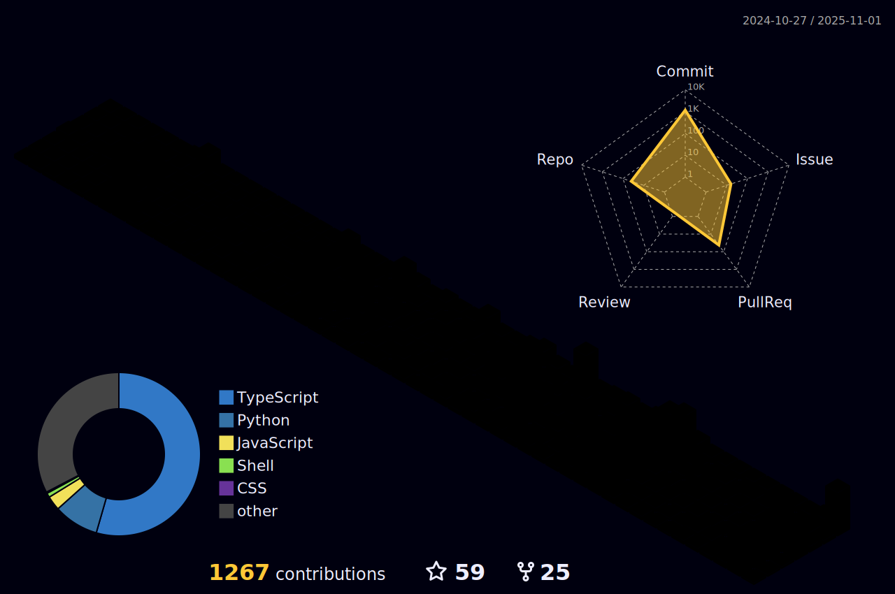

 
<h3 align="center">A Passionate cybersecurity student, driven by curiosity, seeks to master in machine learning-infused defense strategies.</h3>

<p align="left">  </p>


<p align="left"> <a href="https://twitter.com/abhishekpanthee" target="blank"></a> </p>
<p align="center"> 

</p>
</br>
</br>


- 👨‍💻 All of my Cetificates are available at [Certificates](https://abhishekpanthee.com.np/certificates)

- 👨‍💻 All of my Socials are available at [Socials](https://links.abhishekpanthee.com.np/)

- 👨‍💻 All of my projects are available at [abhishekpanthee](https://github.com/abhishekpanthee)

- 📝 I regularly write poems on [blog](https://abhishekpanthee.com.np/posts)
  
- 📝 See my [CV](https://abhishekpanthee.com.np/cv)

- 📫 How to reach me **contact@abhishekpanthee.com.np**

```mermaid
mindmap
  root((Skills))
    Programming
      Python 🐍
      C++ ⚡
      JavaScript 🌐
    AI &amp; ML
      TensorFlow 🧠
      PyTorch 🔥
      Scikit-learn 📊
      Langchain ⛓️
    Web Development
      Typescript
      Tailwind
      Django
      Next js 🇳
    Tools &amp; Technologies
      Git 📂
      Docker 🐳 
      Linux 🐧
      Oracle SQL 💾
      Data Structures 📚
      Algorithms 🔍
      OOP 🎯
      Distributed Systems 🌐
      TCP/IP 🔌
```


<p align="center">



</p>


<h3 align="left">Connect with me:</h3>
<p align="left">
👇 Enter this on your console or terminal to reach out programmatically.

```bash
npx abhi-dev
```
**👆 This command line tool can be found at [npx abhi-dev](https://github.com/abhishekpanthee/npx-card)**


</p>
<p align="center">
<a href="https://dev.to/abhishekpanthee" target="blank"></a>
<a href="https://twitter.com/abhishekpanthee" target="blank"></a>
<a href="https://linkedin.com/in/abhishek-panthee" target="blank"></a>
<a href="https://dribbble.com/abhishekpanthee" target="blank"></a>
<a href="https://www.hackerrank.com/abhishek_080bct1" target="blank"></a>
<a href="https://www.leetcode.com/abhishekpanthee" target="blank"></a>
</p>

<p align="center">
<h2 align="center">🚀 My Dev Tools 🫰 </h2>
</p>
<table align="center" cellpadding="10"> 
    <tr>
        <td align="center" width="96">
            <a href="https://www.typescriptlang.org/" target="_blank">
                
            </a>
        </td>
        <td align="center" width="96">
            <a href="https://www.python.org/" target="_blank">
                
            </a>
        </td>
        <td align="center" width="96">
            <a href="https://www.cplusplus.com/" target="_blank">
                
            </a>
        </td>
        <td align="center" width="96">
            <a href="https://www.gnu.org/software/bash/" target="_blank">
                
            </a>
        </td>
    </tr>
    <tr>
        <td align="center" width="96">
            <a href="https://nextjs.org/" target="_blank">
                
            </a>
        </td>
        <td align="center" width="96">
            <a href="https://tailwindcss.com/" target="_blank">
                
            </a>
        </td>
        <td align="center" width="96">
            <a href="https://canva.com/" target="_blank">
                
            </a>
        </td>
         <td align="center" width="96">
            <a href="https://canva.com/" target="_blank">
                
            </a>
        </td>
    </tr>
    <tr>
        <td align="center" width="96">
            <a href="https://pytorch.org/" target="_blank">
                
            </a>
        </td>
        <td align="center" width="96">
            <a href="https://scikit-learn.org/" target="_blank">
                
            </a>
        </td>
        <td align="center" width="96">
            <a href="https://langchain.com/" target="_blank">
                
            </a>
        </td>
        <td align="center" width="96">
            <a href="https://www.tensorflow.org/" target="_blank">
                
            </a>
        </td>
    </tr>
    <tr>
        <td align="center" width="120">
            <a href="https://www.wireshark.org/" target="_blank">
                
            </a>
        </td>
         <td align="center" width="120">
            <a href="https://www.metasploit.com/" target="_blank">
                
            </a>
        </td>
        <td align="center" width="96">
            <a href="https://www.openvas.org/" target="_blank">
                
            </a>
        </td>
        <td align="center" width="96">
            <a href="https://www.kali.org" target="_blank">
                
            </a>
        </td>
    </tr>
    <tr>
        <td align="center" width="96">
            <a href="https://vercel.com/" target="_blank">
                
            </a>
        </td>
        <td align="center" width="96">
            <a href="https://www.cloudflare.com/" target="_blank">
                
            </a>
        </td>
         <td align="center" width="96">
            <a href="https://www.netlify.com/" target="_blank">
                
            </a>
        </td>
         <td align="center" width="96">
            <a href="https://nginx.org/" target="_blank">
                
            </a>
        </td>
    </tr>
    <tr>
    </tr>
    <tr>
        <td align="center" width="96">
            <a href="https://git-scm.com/" target="_blank">
                
            </a>
        </td>
        <td align="center" width="96">
            <a href="https://github.com/" target="_blank">
                
            </a>
        </td>
        <td align="center" width="96">
            <a href="https://code.visualstudio.com/" target="_blank">
                
            </a>
        </td>
        <td align="center" width="96">
            <a href="https://www.linux.org/" target="_blank">
                
            </a>
        </td>
    </tr>
</table>


<h3 align="left">Support:</h3>
<p>
  <a href="https://www.buymeacoffee.com/abhishekpa5">
    
  </a>
  <a href="https://ko-fi.com/abhishekpanthee">
    
  </a>
</p>
<br><br>
<div align="center">
  <h2>📊 GitHub Statistics</h2>
  
  
  <p align="center">
    
    
  </p>

  <h3>🏆 GitHub Achievements</h3>
   
</div>

<br><br>




